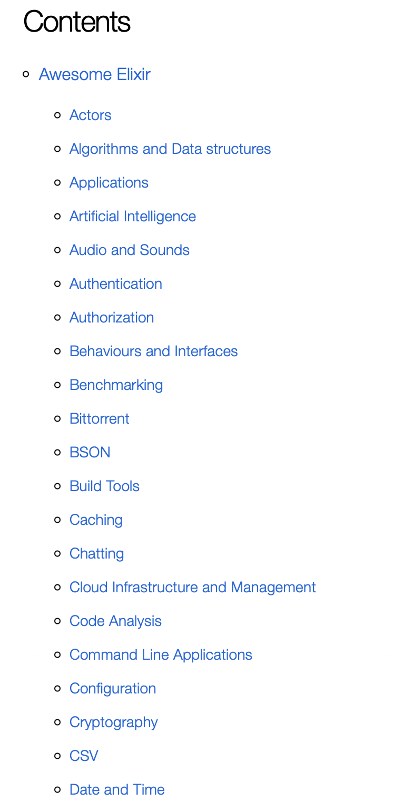
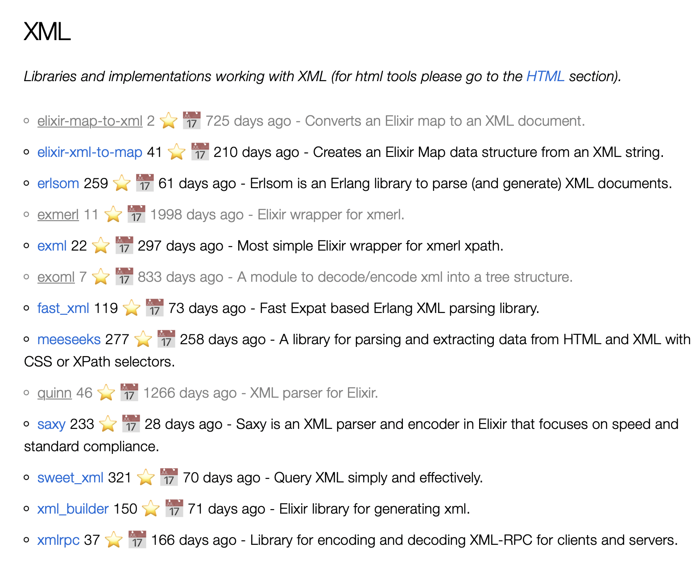

# AwesomeElixir

HTML version of [`awesome-elixir`](https://github.com/h4cc/awesome-elixir)
GitHub repo. Each library provided with additional info:

- Amount of total GitHub stars ⭐
- 📅 Days from last push to repo

## Installation

Project built upon Phoenix - Elixir web framework.
You need to install it first along with Elixir 🙂.<br>
After that run:

```sh
mix deps.get
mix phx.server
```

## Usage

Visit [`localhost:4000`](http://localhost:4000) from your browser after installation.

## Features

- Shows [Elixir awesomness](https://github.com/h4cc/awesome-elixir) in HTML
- Sorting libraries by GitHub stars
- Shows list of most relevant/popular libraries

## Updates

You should provide your [GitHub API token](https://docs.github.com/en/authentication/keeping-your-account-and-data-secure/creating-a-personal-access-token) for daily updates.
Create file `dev.secret.exs` under `config/` folder with following content:

```elixir
import Config

config :github, api_token: <YOUR GITHUB TOKEN>
```

## App view

App looks similar like this:

<div>
  
</div>

<div>
  
</div>


